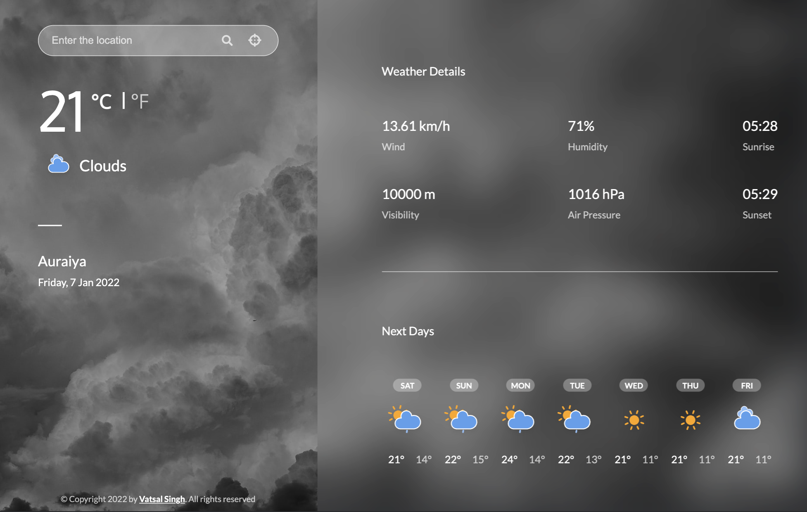
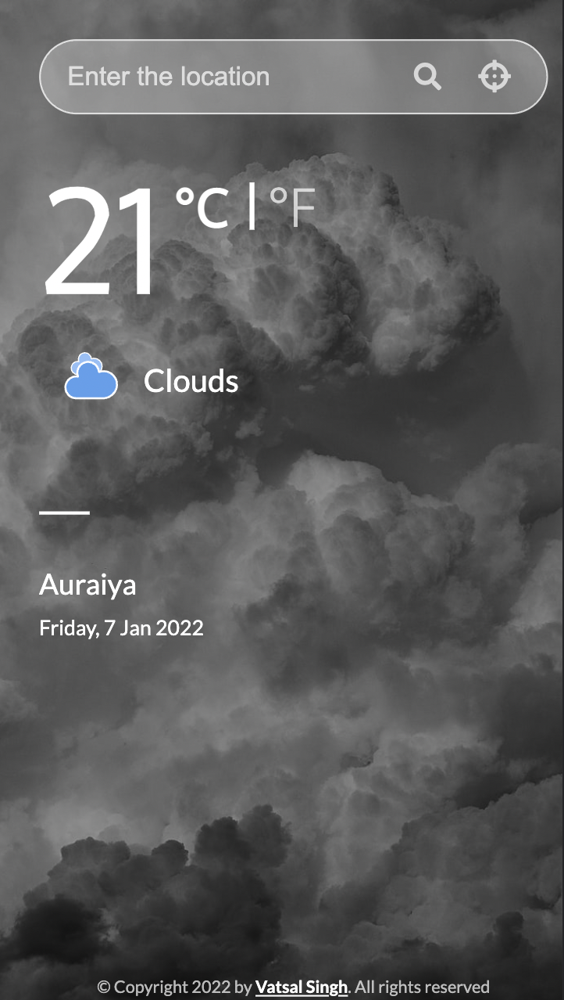
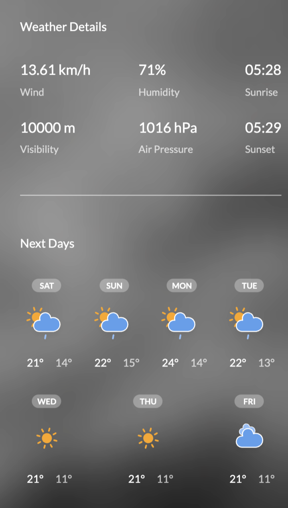
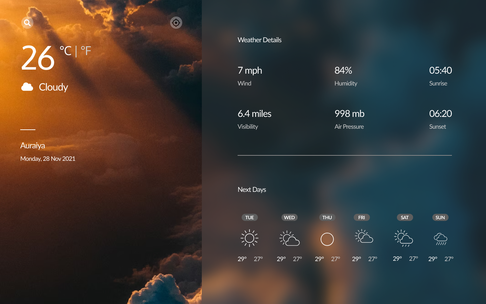
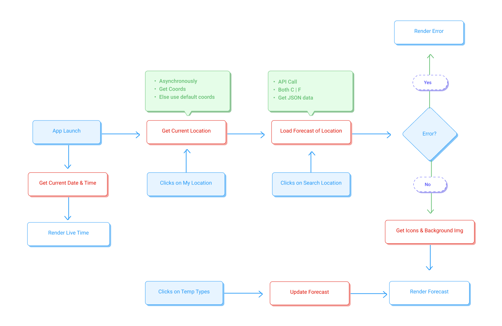

# Weather App

## Table of Contents

- [Overview](#overview)
  - [Screenshot](#screenshot)
  - [Links](#Link)
- [My process](#my-process)
  - [Built With](#built-with)
  - [Steps](#steps)
    - [User Stories](#user-stories)
    - [Features](#features)
    - [Design](#design)
    - [Workflow](#workflow)
  - [What I learned](#what-i-learned)
  - [Useful resources](#useful-resources)
- [Author](#author)
- [Acknowledgements](#acknowledgements)
- [Chrome Extension Feature](#chrome-extension-feature)
  - [Installing the Chrome Extension](#installing-the-chrome-extension)
  - [Using the Extension](#using-the-extension)
  - [Extension Settings](#extension-settings)
- [Future Improvements](#future-improvements)

## Overview

Weather forecast app. Check the weather for any city in the world, with weather forecast of next 7 days and relevant images of weather.

### Screenshot





### Links

- Live Site URL: [https://weather-kv.netlify.app/](https://weather-kv.netlify.app/)
- Chrome Extension: [Download from Chrome Web Store](#) (Coming Soon)

## My process

### Built With

- Semantic HTML5 markup
- CSS Flexbox
- CSS Grid
- Desktop-First workflow
- 7-1 Sass Architecture
- MVC Architecture
- [openweathermap](https://openweathermap.org/) - Weather API
- [Mapbox](https://www.mapbox.com/) - Geocoding API
- [Sass](https://sass-lang.com/) - CSS extension language
- [jQuery](https://jquery.com/) - JS library
- [Parcel](https://parceljs.org/) - Bundler
- Chrome Extension API (Manifest V3)

### Steps

#### User Stories

- I can see city weather as default, preferably my current location
- I can search for city
- I can see weather of today and the next 7 days
- I can see the date and location of the weather
- I can see according to image for each type of weather
- I can see the min and max degree each day
- I can see wind speed
- I can see humidity percentage
- I can see a visibility indicator
- I can see the air pressure number
- I can request my current location weather
- I can convert temperature in celcius to Fahrenheit and vice versa
- I can see image according to the current weather

#### Features

- App displays forecast of current day
- App displays forecast of next 7 days day
- App takes current location of user as default location
- App lets user search for any location
- App lets user to see temperature in celcius as well as fahrenheit

#### Design



#### Workflow



### What I learned

I've learned lot of stuff in this challenge:

- Sass Architecture

```bash
sass
├── abstract
│   ├── _mixins.scss
│   └── _variables.scss
├── base
│   ├── _base.scss
│   ├── _index.scss
│   ├── _reset.scss
│   ├── _typography.scss
│   └── _utilities.scss
├── components
│   ├── _error.scss
│   ├── _index.scss
│   ├── _search-bar.scss
│   └── _spinner.scss
├── layouts
│   ├── _details.scss
│   ├── _index.scss
│   └── _sidebar.scss
└── main.scss
```

- MVC Architecture

```bash
js
├── config.js
├── controller.js
├── helper.js
├── model.js
└── views
    ├── backgroundView.js
    ├── detailView.js
    ├── searchView.js
    ├── sidebarView.js
    └── view.js
```

- Open Graph meta tags

  Open Graph meta tags are snippets of code that control how URLs are displayed when shared on social media.

```html
<!-- Open Graph / Facebook -->
<meta property="og:type" content="website" />
<meta property="og:url" content="https://weather-kv.netlify.app/" />
<meta property="og:title" content="Weather App" />

<meta
	property="og:description"
	content="Check the weather for any city in the world, with weather forecast of next 7 days and relevant images of weather."
/>

<meta
	property="og:image"
	itemprop="image"
	content="https://user-images.githubusercontent.com/68834718/148419702-491fa08d-e520-4e2f-b219-374ec7118b2b.png"
/>

<!-- Twitter -->
<meta property="twitter:card" content="summary_large_image" />
<meta property="twitter:url" content="https://weather-kv.netlify.app/" />
<meta property="twitter:title" content="Weather App" />

<meta
	property="twitter:description"
	content="Check the weather for any city in the world, with weather forecast of next 7 days and relevant images of weather."
/>

<meta
	property="twitter:image"
	content="https://user-images.githubusercontent.com/68834718/148419702-491fa08d-e520-4e2f-b219-374ec7118b2b.png"
/>
```

- To use bundler (Parcel)

```json
"scripts": {
  "start": "parcel index.html",
  "build": "parcel build index.html --dist-dir ./dist"
},
"dependencies": {
  "@parcel/transformer-image": "^2.0.1",
  "@parcel/transformer-svg": "^2.1.0",
  "dotenv": "^10.0.0",
  "parcel": "^2.1.1"
},
"devDependencies": {
  "@parcel/transformer-sass": "^2.1.1",
  "@parcel/transformer-svgo": "^2.0.0-nightly.1739",
  "autoprefixer": "^10.4.1"
}
```

- To use environment variables (.env)

### Useful resources

- [One Call API](https://openweathermap.org/api/one-call-api)
- [Free animated SVG weather icons](https://www.amcharts.com/free-animated-svg-weather-icons/)
- [JS DateTimeFormat](https://developer.mozilla.org/en-US/docs/Web/JavaScript/Reference/Global_Objects/Intl/DateTimeFormat)
- [tinyjpg](https://tinyjpg.com/)
- [SVG Success Error](https://codepen.io/togglelt/pen/JyewOy)

## Author

- Github - [@kunal](https://github.com/kunal)
- Twitter - [@kunal](https://www.twitter.com/kunal)
- Instagram - [@kunal](https://www.instagram.com/kunal)
- Facebook - [@kunal](https://www.facebook.com/kunal)
- Frontend Mentor - [@kunal](https://www.frontendmentor.io/profile/kunal)

## Acknowledgements

- [Steps to replicate a design with only HTML and CSS](https://devchallenges-blogs.web.app/how-to-replicate-design/)
- [How to build a web app: A beginner's guide](https://budibase.com/blog/how-to-make-a-web-app/)
- [autoprefixer](https://www.npmjs.com/package/autoprefixer)
- [Inspiration](https://devchallenges.io/challenges/mM1UIenRhK808W8qmLWv)

## Chrome Extension Feature

This project is now available as a Chrome Extension with the following features:

- Access weather information directly from your browser toolbar
- Auto-refresh weather data at customizable intervals
- Save your preferences for temperature units
- Offline support with cached weather data
- Badge displaying current temperature
- Responsive popup interface
- Quick access to 7-day forecast

### Installing the Chrome Extension

1. Download the extension files from this repository
2. Open Chrome and navigate to `chrome://extensions/`
3. Enable "Developer mode" using the toggle in the top-right corner
4. Click "Load unpacked" and select the folder containing the extension files
5. The Weather App extension will now appear in your toolbar

### Using the Extension

- Click the extension icon to view current weather and forecast
- Use the search bar to check weather for different locations
- Click the location icon to get weather for your current location
- Toggle between Celsius and Fahrenheit
- Access settings by clicking the gear icon

### Extension Settings

- Choose default temperature units (Celsius or Fahrenheit)
- Set auto-refresh intervals (15min, 30min, 1hr, or manual only)
- Reset to default settings

## Future Improvements

- Add support for dark/light theme toggle
- Implement weather notifications for severe conditions
- Add more detailed hourly forecasts
- Support for multiple saved locations
- Enhanced accessibility features
- Integration with calendar for event weather forecasting
